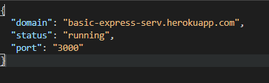
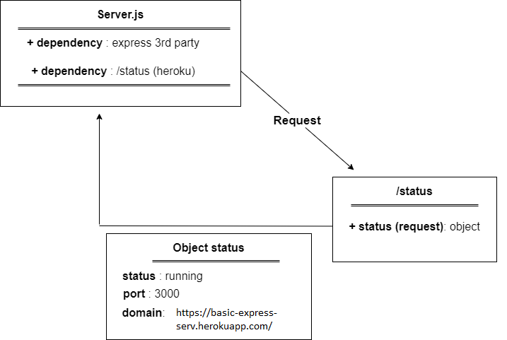
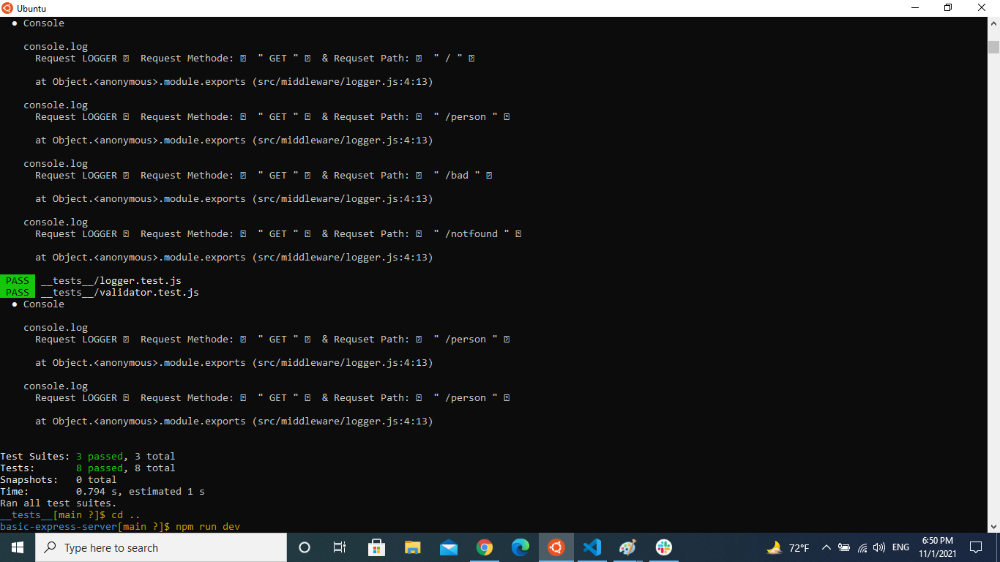

# basic-express-server

* [GitHub Repo Link](https://github.com/samahhamed227/basic-express-server)

* [Heroku Link](https://basic-express-serv.herokuapp.com/) : https://basic-express-serv.herokuapp.com/

* [Test Report](https://github.com/samahhamed227/basic-express-server/runs/4070613388?check_suite_focus=true)
* [Front end](http://localhost:3000/status)
##### Setup
`.env` requirements
  * `PORT` - Port Number

**Running the app**
* `npm start`
* Endpoints:
* ##### 1 -  `/status`
# Returns Object

>
{
  "domain": "basic-express-serv.herokuapp.com",

  "status": "running",

  "port": 3000
}

### Tests
- Unit Tests: npm run test

### UML

**Test Result**

## Notes
[pull request : ](https://github.com/samahhamed227/basic-express-server/pull/1)

How do I install the app or library?

Clone the repo to your local machine
in the terminal, run npm i
Create .env file with port name as the one in the env samples
How do I test the app or library?

in the termenal run npm run test
in the browser hit `localhost:yourPortNumber/person?name=samah`